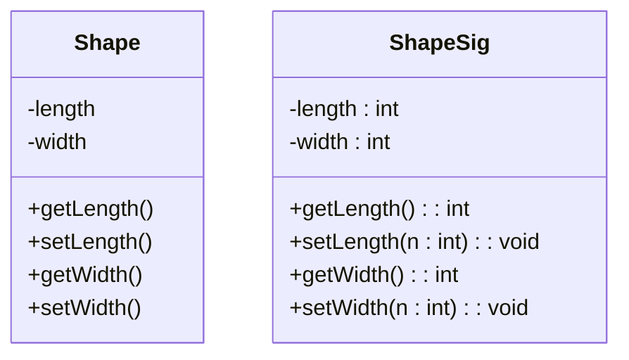
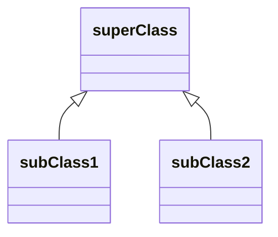

#sample UML diagram for csc 102 by Landon Yates 
#LANYATES@uat.edu

Create a diagram with 2 classes, 3 attributes, 3 methods

Attributes come before properties or methods 
\+ public, \- private, \# protected 
